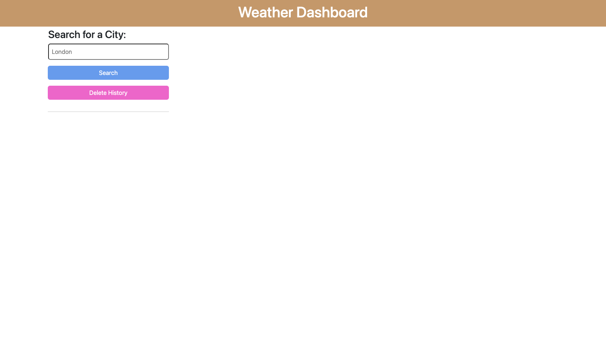
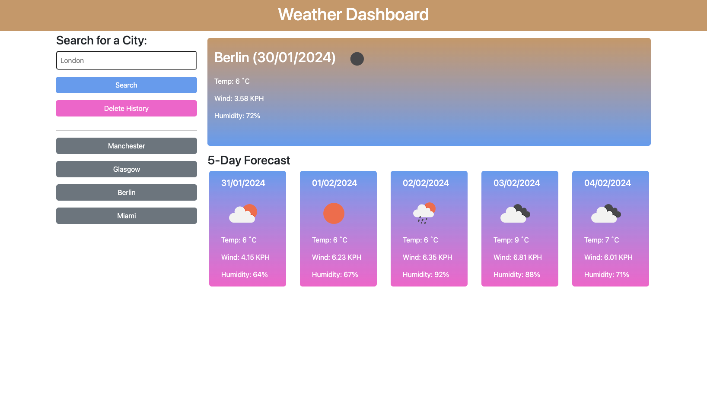

# Weather Dashboard

The criteria for this is as follows:

- Using server side api's from [5 Day Weather Forecast](https://openweathermap.org/forecast5), I had to create a 5 day weather forcast dashboard.
- The dashboard has to recieve user input for of a place.
- Once input has been submitted, the dashboard will show today's weather conditions as well as the next 5 days.
- The data displayed should be City name, date, an icon representing the weather, temperature, humidity and wind speed.
  - Along with a 5 day forecast displaying the date, weather icon, temperature and humidity.
- This will then be stored in the user's localStorage and displayed in the history list on screen.

# Useage

The website can be accessed [here](https://philc7.github.io/weather-dashboard/).

To use the weather dashboard:

- You must click on the input boxx and input a city or placename.
- Click search, then your forecast should appear.
- You can click on any previously searched places from the history list.
- To delete your history, click the 'Delete History' button.

## This is how the page should look.

### Initial page view.

### Page view after retrieving weather data.

# Credits

[Day JS](https://day.js.org/)  
[Open Weather Map](https://openweathermap.org/guide)  
[Bootstrap](https://getbootstrap.com/)  
[W3Schools](https://www.w3schools.com/)

# License

Please refer to the LICENSE in the repo.
